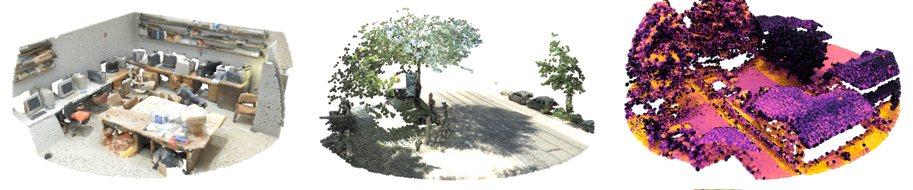
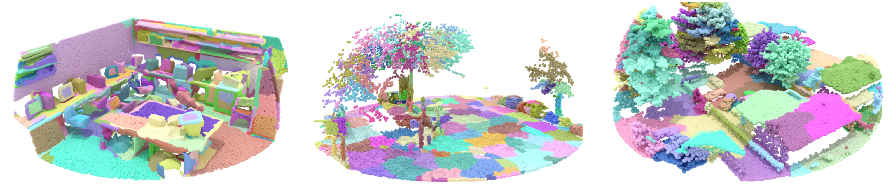
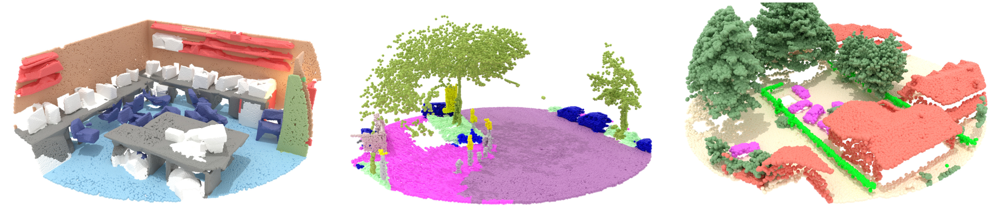

<div align="center">

# Superpoint Transformer

[](https://github.com/pre-commit/pre-commit)
[](https://pytorch.org/get-started/locally/)
[](https://pytorchlightning.ai/)
[](https://hydra.cc/)
[](https://github.com/ashleve/lightning-hydra-template#license)

[//]: # ([![Paper]&#40;http://img.shields.io/badge/paper-arxiv.1001.2234-B31B1B.svg&#41;]&#40;https://www.nature.com/articles/nature14539&#41;)
[//]: # ([![Conference]&#40;http://img.shields.io/badge/AnyConference-year-4b44ce.svg&#41;]&#40;https://papers.nips.cc/paper/2020&#41;)


Official implementation for _Efficient 3D Semantic Segmentation with Superpoint Transformer_ 🚀⚡🔥<br>

</div>

<p align="center">
    
    <br>
    
    <br>
    
</p>


## 📌  Description

HiST is a superpoint-based transformer architecture that efficiently performs 
semantic segmentation on large-scale 3D scenes. This method includes a fast 
algorithm that partitions point clouds into a hierarchical superpoint structure, 
as well as a self-attention mechanism to exploit the relationships between 
superpoints at multiple scales. 

## 🧱  Installation

```bash
# Creates an conda named 'spt' env and installs dependencies
./install.sh
```

Setup your `data/` and `logs/` directories. By default, these folders will 
be placed in the project directory. But since these may quickly take some space,
you may specify your default paths for these directories by creating the
`configs/local/defaults.yaml` file with the following format:

```yaml
# @package paths

# path to data directory
data_dir: /path/to/your/data/

# path to logging directory
log_dir: /path/to/your/logs/
```

<details>
<summary><b>Logs will be saved under the following directory structure.</b></summary>

```
├── logs
│   ├── task_name
│   │   ├── runs                        # Logs generated by single runs
│   │   │   ├── YYYY-MM-DD_HH-MM-SS       # Datetime of the run
│   │   │   │   ├── .hydra                  # Hydra logs
│   │   │   │   ├── csv                     # Csv logs
│   │   │   │   ├── wandb                   # Weights&Biases logs
│   │   │   │   ├── checkpoints             # Training checkpoints
│   │   │   │   └── ...                     # Any other thing saved during training
│   │   │   └── ...
│   │   │
│   │   └── multiruns                   # Logs generated by multiruns
│   │       ├── YYYY-MM-DD_HH-MM-SS       # Datetime of the multirun
│   │       │   ├──1                        # Multirun job number
│   │       │   ├──2
│   │       │   └── ...
│   │       └── ...
│   │
│   └── debugs                          # Logs generated when debugging config is attached
│       └── ...
```

</details>


## 🚀  Reproducing our results

<details>
<summary><b>What will next commands do for you ?</b></summary>

- Download the dataset to your `data/` 
- Place the raw dataset files in `data/<dataset_name>/raw/`
- Preprocess the dataset and save the output to `data/<dataset_name>/processed/`
- Training a model and log the results

</details>


```bash
# Train HiST on S3DIS Fold 5
python src/train.py trainer=gpu model=hist_s3dis datamodule=s3dis datamodule.fold=5 trainer.max_epochs=2000

# Train HiST on KITTI-360 Val
python src/train.py trainer=gpu model=hist_kitti360 datamodule=kitti360 trainer.max_epochs=200 

# Train HiST on DALES
python src/train.py trainer=gpu model=hist_dales datamodule=dales trainer.max_epochs=400
```

You may use [Weights and Biases](https://wandb.ai) to track your experiments, 
by adding the adequate argument:

```bash
# Log S3DIS experiments to W&B
python src/train.py logger=wandb_s3dis ...

# Log KITTI-360 experiments to W&B
python src/train.py logger=wandb_kitti360 ...

# Log DALEs experiments to W&B
python src/train.py logger=wandb_dales ...
```


## 💳  Credits
- This project was built using [Lightning-Hydra template](https://github.com/ashleve/lightning-hydra-template).
- The main data structures of this work rely on [PyToch Geometric](https://github.com/pyg-team/pytorch_geometric)
- Some point cloud operations were inspired from the [Torch-Points3D framework](https://github.com/nicolas-chaulet/torch-points3d), although not merged with the official project at this point. 
- For the KITTI-360 dataset, some code from the official [KITTI-360](https://github.com/autonomousvision/kitti360Scripts) was used.
- Some superpoint-graph-related operations were inspired from [Superpoint Graph](https://github.com/loicland/superpoint_graph)
- The hierarchical superpoint partition is computed using [Parallel Cut-Pursuit](https://gitlab.com/1a7r0ch3/parallel-cut-pursuit)


## License

HiST is licensed under the MIT License.

```
MIT License

Copyright (c) 2021 ashleve

Permission is hereby granted, free of charge, to any person obtaining a copy
of this software and associated documentation files (the "Software"), to deal
in the Software without restriction, including without limitation the rights
to use, copy, modify, merge, publish, distribute, sublicense, and/or sell
copies of the Software, and to permit persons to whom the Software is
furnished to do so, subject to the following conditions:

The above copyright notice and this permission notice shall be included in all
copies or substantial portions of the Software.

THE SOFTWARE IS PROVIDED "AS IS", WITHOUT WARRANTY OF ANY KIND, EXPRESS OR
IMPLIED, INCLUDING BUT NOT LIMITED TO THE WARRANTIES OF MERCHANTABILITY,
FITNESS FOR A PARTICULAR PURPOSE AND NONINFRINGEMENT. IN NO EVENT SHALL THE
AUTHORS OR COPYRIGHT HOLDERS BE LIABLE FOR ANY CLAIM, DAMAGES OR OTHER
LIABILITY, WHETHER IN AN ACTION OF CONTRACT, TORT OR OTHERWISE, ARISING FROM,
OUT OF OR IN CONNECTION WITH THE SOFTWARE OR THE USE OR OTHER DEALINGS IN THE
SOFTWARE.
```
