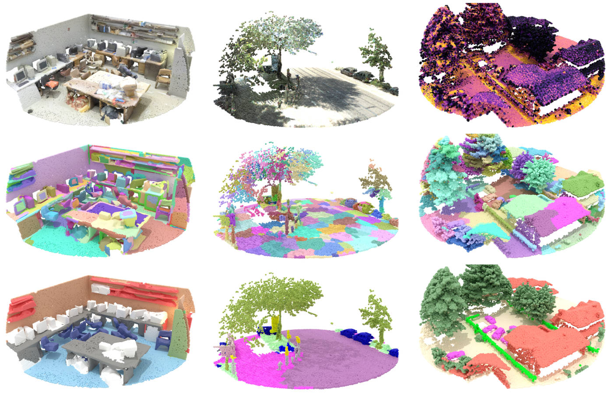

<div align="center">

# Superpoint Transformer

[](https://github.com/pre-commit/pre-commit)
[](https://pytorch.org/get-started/locally/)
[](https://pytorchlightning.ai/)
[](https://hydra.cc/)
[](https://github.com/ashleve/lightning-hydra-template#license)

[//]: # ([![Paper]&#40;http://img.shields.io/badge/paper-arxiv.1001.2234-B31B1B.svg&#41;]&#40;https://www.nature.com/articles/nature14539&#41;)
[//]: # ([![Conference]&#40;http://img.shields.io/badge/AnyConference-year-4b44ce.svg&#41;]&#40;https://papers.nips.cc/paper/2020&#41;)


Official implementation for
<br>
_Efficient 3D Semantic Segmentation with Superpoint Transformer_
<br>
🚀⚡🔥
<br>


</div>

<p align="center">
    
</p>

## 📌  Description

SPT is a superpoint-based transformer 🤖 architecture that efficiently ⚡ 
performs semantic segmentation on large-scale 3D scenes. This method includes a 
fast algorithm that partitions 🧩 point clouds into a hierarchical superpoint 
structure, as well as a self-attention mechanism to exploit the relationships 
between superpoints at multiple scales. 

## 📰  Updates

- **15.06.2023 Official release** 🌱

## 🧱  Installation
Simply run `install.sh` to install all dependencies in a new conda environment 
named `spt`. 
```bash
# Creates a conda env named 'spt' env and installs dependencies
./install.sh
```

### Setting up `data/` and `logs/`
The `data/` and `logs/` directories will store all your datasets and training 
logs. By default, these are placed in the repository directory. 

Since this may take some space, or your heavy data may be stored elsewhere, you 
may specify other paths for these directories by creating a 
`configs/local/defaults.yaml` file with  the following structure:

```yaml
# @package paths

# path to data directory
data_dir: /path/to/your/data/

# path to logging directory
log_dir: /path/to/your/logs/
```

<details>
<summary><b>Data directory structure.</b></summary>

Datasets are stored under the following structure:

```
└── data
    ├── dales                                         # Structure for DALES
    │   ├── DALESObjects.tar.gz                         # (optional) Downloaded zipped dataset
    │   ├── raw                                         # Raw dataset files
    │   │   └── {{train, test}}                           # DALES' split/tile.ply structure
    │   │       └── {{tile_name}}.ply
    │   └── processed                                   # Preprocessed data
    |       └── {{train, val, test}}                      # Dataset splits
    |           └── {{preprocessing_hash}}                  # Preprocessing folder
    │               └── {{tile_name}}.h5                      # Preprocessed tile file
    │    
    ├── kitti360                                      # Structure for KITTI-360
    │   ├── raw                                         # Raw dataset files
    │   │   ├── data_3d_semantics_test.zip              # (optional) Downloaded zipped test dataset
    │   │   ├── data_3d_semantics.zip                   # (optional) Downloaded zipped train dataset
    │   │   └── data_3d_semantics                       # Contains all raw train and test sequences
    │   │       └── {{sequence_name}}                     # KITTI-360's sequence/static/window.ply structure
    │   │           └── static
    │   │               └── {{window_name}}.ply
    │   └── processed                                   # Preprocessed data
    │       └── {{train, val, test}}                      # Dataset splits
    │           └── {{preprocessing_hash}}                  # Preprocessing folder
    │               └── {{sequence_name}}
    │                   └── {{window_name}}.h5                # Preprocessed window file
    │    
    └── s3dis                                         # Structure for S3DIS
        ├── Stanford3dDataset_v1.2.zip                  # (optional) Downloaded zipped dataset
        ├── raw                                         # Raw dataset files
        │   └── Area_{{1, 2, 3, 4, 5, 6}}                 # S3DIS's area/room/room.txt structure
        │       └── {{room_name}}  
        │           └── {{room_name}}.txt
        └── processed                                   # Preprocessed data
            └── {{train, val, test}}                      # Dataset splits
                └── {{preprocessing_hash}}                  # Preprocessing folder
                    └── Area_{{1, 2, 3, 4, 5, 6}}.h5          # Preprocessed Area file
```

All datasets inherit from the `torch_geometric` `Dataset` class, allowing for 
automated download (when allowed), preprocessing and inference-time transforms. 
See the [official documentation](https://pytorch-geometric.readthedocs.io/en/latest/tutorial/create_dataset.html)
for more details.

Different from `torch_geometric`, you can have multiple preprocessed versions of 
each dataset.

</details>

<details>
<summary><b>Logs directory structure.</b></summary>

Your logs will be saved under the following structure:

```
├── logs
│   ├── task_name
│   │   ├── runs                        # Logs generated by single runs
│   │   │   ├── YYYY-MM-DD_HH-MM-SS       # Datetime of the run
│   │   │   │   ├── .hydra                  # Hydra logs
│   │   │   │   ├── csv                     # Csv logs
│   │   │   │   ├── wandb                   # Weights&Biases logs
│   │   │   │   ├── checkpoints             # Training checkpoints
│   │   │   │   └── ...                     # Any other thing saved during training
│   │   │   └── ...
│   │   │
│   │   └── multiruns                   # Logs generated by multiruns (ie using --multirun)
│   │       ├── YYYY-MM-DD_HH-MM-SS       # Datetime of the multirun
│   │       │   ├──1                        # Multirun job number
│   │       │   ├──2
│   │       │   └── ...
│   │       └── ...
│   │
│   └── debugs                          # Logs generated when debugging config is attached
│       └── ...
```

</details>

## 🚀  Reproducing our results
### Dataset structure
Datasets are saved `data/<dataset_name>`

### Training SPT
By default, the training scripts will automatically do the following:
- Search the dataset your `data/<dataset_name`
- Download the dataset to your `data/` (if the dataset creators permit automatic download, else a prompt will indicate how to proceed manually)
- Place the raw dataset files in `data/<dataset_name>/raw/`
- Preprocess the dataset and save the output to `data/<dataset_name>/processed/`
- Training a model and log the results

```bash
# Train SPT on S3DIS Fold 5
python src/train.py trainer=gpu model=spt_s3dis datamodule=s3dis datamodule.fold=5 trainer.max_epochs=2000

# Train SPT on KITTI-360 Val
# ⚠️ KITTI-360 does not support automatic download, follow prompted instructions
python src/train.py trainer=gpu model=spt_kitti360 datamodule=kitti360 trainer.max_epochs=200 

# Train SPT on DALES
python src/train.py trainer=gpu model=spt_dales datamodule=dales trainer.max_epochs=400
```

You may use [Weights and Biases](https://wandb.ai) to track your experiments, 
by adding the adequate argument:

```bash
# Log S3DIS experiments to W&B
python src/train.py logger=wandb_s3dis ...

# Log KITTI-360 experiments to W&B
python src/train.py logger=wandb_kitti360 ...

# Log DALES experiments to W&B
python src/train.py logger=wandb_dales ...
```

### Evaluating SPT


## 💳  Credits
- This project was built using [Lightning-Hydra template](https://github.com/ashleve/lightning-hydra-template).
- The main data structures of this work rely on [PyToch Geometric](https://github.com/pyg-team/pytorch_geometric)
- Some point cloud operations were inspired from the [Torch-Points3D framework](https://github.com/nicolas-chaulet/torch-points3d), although not merged with the official project at this point. 
- For the KITTI-360 dataset, some code from the official [KITTI-360](https://github.com/autonomousvision/kitti360Scripts) was used.
- Some superpoint-graph-related operations were inspired from [Superpoint Graph](https://github.com/loicland/superpoint_graph)
- The hierarchical superpoint partition is computed using [Parallel Cut-Pursuit](https://gitlab.com/1a7r0ch3/parallel-cut-pursuit)

## Citing our work
If your work uses all or part of the present code, please include the following a citation:

```
@inproceedings{robert2023spt,
  title={Efficient 3D Semantic Segmentation with Superpoint Transformer},
  author={Robert, Damien and Raguet, Hugo and Landrieu, Loic},
  booktitle={arxiv},
  year={2023}
}
```